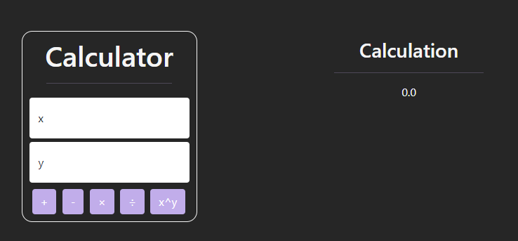
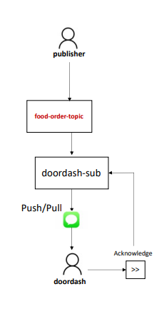

# Serverless practice

* ## [use my serverless calculator and pubsub example here](https://storage.googleapis.com/quiz8-bucket/index.html)

***What is serverless computing?***

    Serverless computing is a model of computing in which the server is not
    responsible for the execution of the application. Instead, the server
    executes the application on behalf of the client.

## Task 1

Create and deploy a Cloud Function using python and GCP CloudFunctions (***serverless***)

HTTP arguments:

* op: “add”, “sub”, ”mul”, ”div”, "pow"
* num1 (number)
* num2 (number)

## Task 2

create a pub-sub topic and a subscription to an order topic

